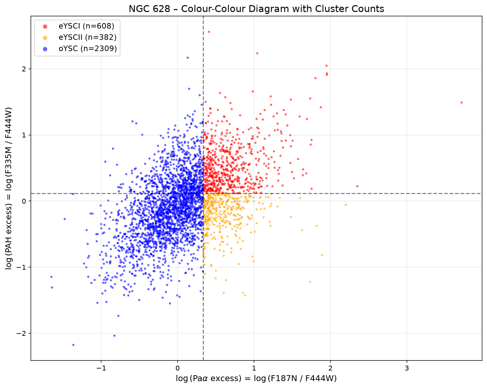
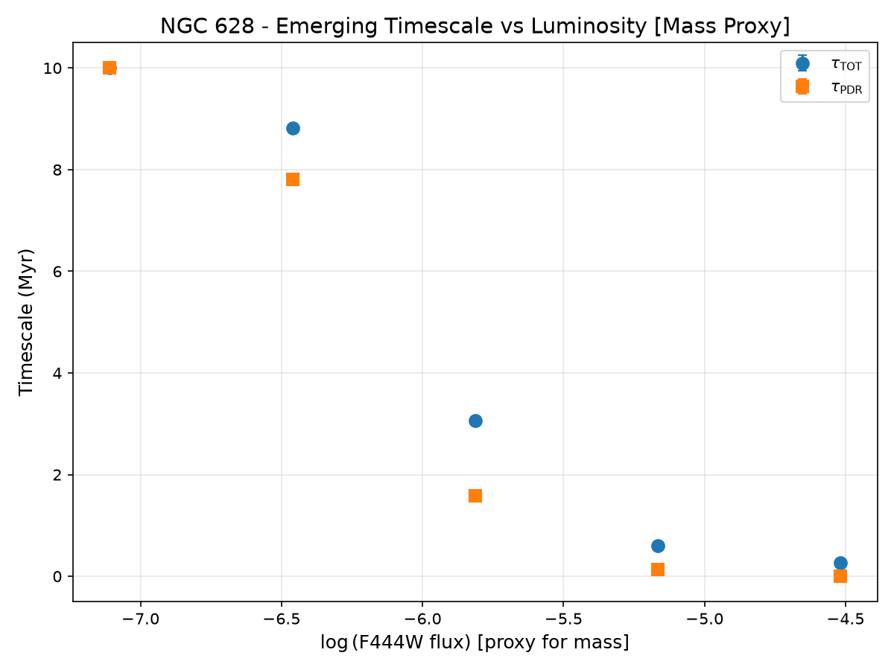
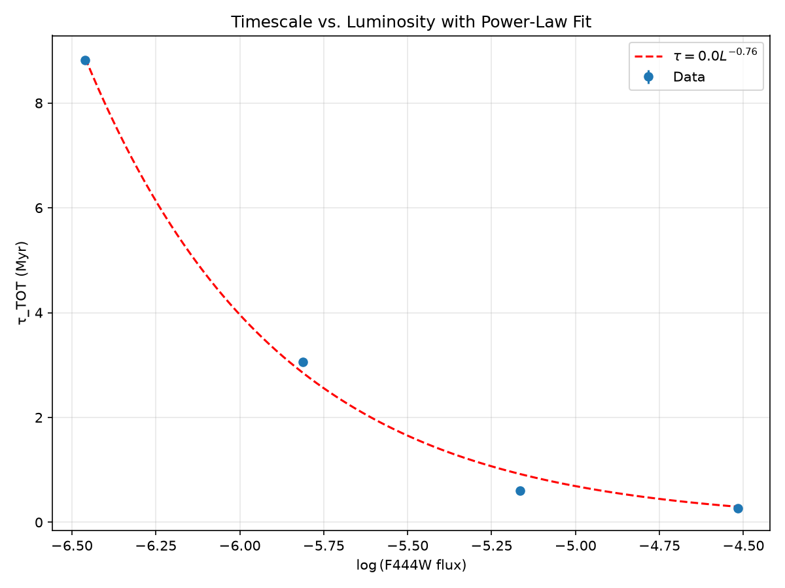

# Emergence Timescales of Young Star Clusters in NGC 628
## Reproduction of Pedrini et al. (2026) Using JWST NIRCam Data

[](https://www.python.org/)
[](LICENSE)
[](https://archive.stsci.edu/)

---

## Abstract

We reproduce the emergence timescale analysis of young star clusters in NGC 628 using archival JWST NIRCam data. Using seven filters (F115W–F444W), we construct a multi-band catalog of 3,300+ sources. Clusters are classified into three evolutionary stages — eYSCI (embedded with PDR), eYSCII (embedded without PDR), and oYSC (optically exposed) — based on Pa$\alpha$ and PAH excess. We derive emergence timescales ($\tau_{\mathrm{TOT}}$ and $\tau_{\mathrm{PDR}}$) as a function of luminosity. Our results confirm the key finding of Pedrini et al. (2026): more luminous (massive) clusters emerge faster, with $\tau_{\mathrm{TOT}}$ decreasing from 10 Myr to 0.3 Myr across the luminosity range.

---

## Introduction

Young star clusters form within dense molecular clouds. Their emergence — the process of clearing natal gas — determines star formation efficiency, ionizing photon escape, and planet formation timescales. Pedrini et al. (2026) showed that massive clusters emerge faster than low-mass clusters using JWST and HST data.

This project reproduces their analysis for NGC 628 using **only JWST NIRCam** data, demonstrating that the key result is robust even without HST optical data.

---

## Data

| Property | Description |
|----------|-------------|
| **Target** | NGC 628 (M74) |
| **Telescope** | JWST NIRCam |
| **Programme** | 1783 (FEAST) |
| **Filters** | F115W, F150W, F187N, F200W, F277W, F335M, F444W |
| **Data Source** | MAST Archive (DOI: 10.17909/f4vm-c771) |
| **Catalog Format** | ECSV (per filter) |

---

## Pipeline Overview

The analysis consists of four sequential scripts:

1. Classification_Catalog_Quality_Cuts.py  
├── Merge 7 ECSV catalogs by source label  
├── Apply quality cuts (S/N > 3, positive fluxes, morphology)  
├── Compute Pa and PAH excess  
├── Classify into eYSCI / eYSCII / oYSC  
└── Save clean catalog  


2. Classification_Monte_Carlo.py  
├── Generate synthetic ages for oYSCs  
├── Bin by luminosity (5 bins)  
├── Monte Carlo sampling of ages (1000 iterations)  
├── Compute τ_TOT and τ_PDR per bin  
└── Save timescale_mc_results.csv + timescale_mc.png  

  
3. Additional_Plot_Analysis.py  
├── Spatial map (RA vs Dec)  
├── Flux histograms (F187N, F335M)  
├── Luminosity boxplot  
└── Power-law fit to timescale trend    


4. Monte_Carlo_Poisson_Uncertainty.py  
└── Poisson sampling of counts (10000 iterations)  
→ Global τ_TOT ± σ, τ_PDR ± σ  


---

## Classification

Clusters are classified based on two excess ratios:

$$\mathrm{Pa}_{\mathrm{exc}} = \frac{F_{187N}}{F_{444W}}, \qquad \mathrm{PAH}_{\mathrm{exc}} = \frac{F_{335M}}{F_{444W}}$$

Thresholds are set at the 70th (Pa) and 60th (PAH) percentiles:

| Class | Pa Excess | PAH Excess | Interpretation |
|-------|-----------|------------|----------------|
| **eYSCI** | High | High | Embedded with PDR |
| **eYSCII** | High | Low | Embedded, PDR dispersed |
| **oYSC** | Low | Low | Optically exposed |

### Final Counts

| Class | After Quality Cuts |
|-------|-------------------|
| eYSCI | 608 |
| eYSCII | 382 |
| oYSC | 2309 |

---

## Results

### Colour-Colour Diagram

The three classes occupy distinct regions in log(Pa excess) vs log(PAH excess) space.



### Timescale vs Luminosity

Both $\tau_{\mathrm{TOT}}$ and $\tau_{\mathrm{PDR}}$ decrease with increasing luminosity (mass proxy), confirming that **massive clusters emerge faster**.



### Power-Law Fit

$$\tau_{\mathrm{TOT}} \propto L^{-0.76}$$

The negative exponent quantifies the inverse relation between mass and emergence timescale.



### Flux Histogram

Pa(F187N) and PAH(F335M) Flux Distribution


---

## Installation

Run the Bash
```bash
git clone https://github.com/BaronGhost/Emergence-Timescale-NGC628.git
cd Emergence-Timeescale-NGC628

python3 -m venv venv
source venv/bin/activate   

pip install -r requirements.txt

python main.py
```

## References

_1. Pedrini, A., et al. 2026, Nature Astronomy, **10**, 1038/s41550-026-02857-y._

_2. MAST 2025, JWST NIRCam Observations of NGC 628 (FEAST Programme **#1783**), doi:10.17909/f4vm-c771._

_3. Lada, C. J., & Lada, E. A. 2003, ARA&A, **41**, 57._

_4. Krumholz, M. R., McKee, C. F., & Bland-Hawthorn, J. 2019, ARA&A, **57**, 227._

## Acknowledgements

This work reproduces results from _Pedrini et al. (2026)_ using data from the JWST FEAST programme _(PI: A. Adamo)_. Data were obtained from the _MAST archive_.

## Author

SHAFKAT MAHBUB  
Studying at Dept of ETE in CUET  
_u2308029@student.cuet.ac.bd_
